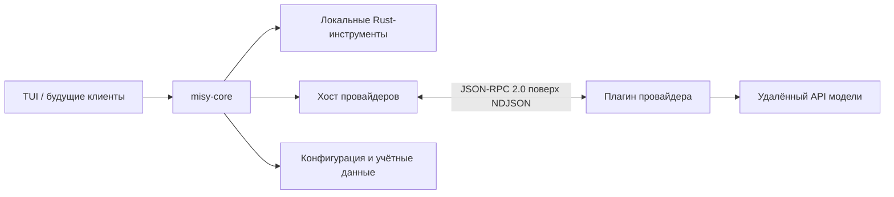

[English](README.md) | Русский

# Misy

<p align="center">
  
</p>

Misy — небольшой и быстрый мультипровайдерный агентный harness с независимым Rust-ядром. Ядро
управляет агентным циклом, локальными инструментами, учётными данными, сессиями, отменой операций и
событиями; пользовательские интерфейсы остаются тонкими клиентами, а интеграции с провайдерами
работают как независимые плагины-процессы.

Терминальный интерфейс — первый клиент Misy. Долгосрочная цель проекта — создать переиспользуемую
основу для локальных coding-агентов, а не монолитное терминальное приложение, привязанное к одному
провайдеру моделей или одному интерфейсу.

> [!WARNING]
> Misy находится в активной разработке и пока не готов к обычному использованию. Интерфейсы,
> форматы данных и рабочие процессы могут меняться, а миграция сохранённых данных ещё не
> реализована. Мы рады контрибьюторам и ранним экспериментаторам, но не рекомендуем использовать
> Misy для production-задач или важных данных.

## Сообщество

В [официальном Telegram-сообществе Misy](https://t.me/+xgL2SznTpPxiMTRi) можно обсудить проект,
задать вопросы, предложить идеи и скоординировать работу над изменениями.

## Зачем нужен Misy

Во многих агентных инструментах код интерфейса, оркестрация, особенности конкретных провайдеров и
выполнение локальных инструментов объединены в одном приложении. Из-за этого сложно добавить новый
интерфейс, заменить провайдера или понять, какой компонент имеет доступ к учётным данным и локальной
машине.

Misy разделяет эти обязанности:



- **Rust-ядро и есть harness.** Оно управляет историей диалога, FIFO-очередью запросов,
  агентным циклом и вызовами инструментов, процессами провайдеров, авторизацией, отменой и
  нормализованными событиями.
- **Интерфейсы — клиенты.** TUI отображает состояние ядра и передаёт действия пользователя, но не
  дублирует оркестрацию. В дальнейшем на том же контракте ядра можно создавать другие клиенты.
- **Провайдеры — адаптеры.** Каждый провайдер — самостоятельный, не зависящий от языка реализации
  процесс. Он переводит удалённый API в версионированный протокол Misy, не запускает локальные
  инструменты и не управляет файлами с учётными данными Misy.
- **Локальные возможности остаются локальными.** Описание инструментов, проверка аргументов и
  выполнение принадлежат Rust-ядру, поэтому граница безопасности остаётся явной и тестируемой.

Архитектура подробно описана в [docs/architecture.md](docs/architecture.md). Полный индекс
документации находится в [docs/README.md](docs/README.md).

## Текущее состояние

В репозитории уже работает сквозная версия проекта для разработки:

- переиспользуемый асинхронный crate `misy-core` с конфигурацией, хранением непрозрачных для ядра
  учётных данных, кешем моделей, диалогом в памяти, FIFO-очередью запросов, потоковыми событиями,
  отменой и управлением жизненным циклом процессов провайдеров;
- полноэкранный Ratatui-клиент с многострочным редактором, историей запросов, прокруткой и
  копированием диалога, автодополнением команд, авторизацией провайдеров, выбором моделей, очередью
  запросов, потоковым выводом, отображением инструментов, прерыванием и корректным восстановлением
  терминала;
- версионированный протокол провайдеров JSON-RPC 2.0 с поиском манифестов, ленивым запуском
  процессов, потоковым чатом, браузерной и device-авторизацией, обновлением учётных данных, поиском
  моделей, отменой запросов и опциональной нормализованной статистикой лимитов;
- встроенные плагины подписочных провайдеров OpenAI, Anthropic и Kimi, написанные на TypeScript и
  запускаемые через Bun;
- локальные Rust-инструменты `list_directory`, `read_file`, `write_file` и `run_command` с проверкой
  JSON Schema и ограничениями выполнения;
- модульные, интеграционные, end-to-end и контрактные тесты провайдеров, использующие локальные
  fixtures вместо реальных аккаунтов и внешней сети.

Это фундамент MVP, а не стабильный релиз. В частности, диалоги пока не сохраняются, один процесс
соответствует одной агентной сессии, а TUI ещё не поддерживает prompt-авторизацию, например ввод
API-ключей.

## Что планируется

Следующие направления намеренно отложены и остаются открытыми для будущей разработки:

- явные разрешения и подтверждения для локальных инструментов;
- интеграция MCP;
- сохранение диалогов и восстановление сессий;
- сабагенты и более развитая оркестрация;
- установка и обновление провайдеров через marketplace;
- авторизация по API-ключу и универсальная prompt-авторизация;
- daemon или публичный IPC-интерфейс для нескольких клиентов;
- дополнительные клиенты, включая возможный desktop UI.

Это направления развития, а не обещанный порядок работ или расписание релизов. При подготовке
изменений учитывайте уже принятые архитектурные и UX-решения из
[docs/decisions-and-references.md](docs/decisions-and-references.md).

## Локальный запуск

Понадобятся:

- Rust `1.94.0` с `rustfmt` и Clippy (версию выбирает `rust-toolchain.toml` в репозитории);
- [Bun](https://bun.sh/) для встроенных TypeScript-провайдеров;
- подписка поддерживаемого провайдера для реальных запросов к модели.

Один раз установите TypeScript-зависимости:

```console
cd plugins/providers/_sdk && bun install --frozen-lockfile
cd ../openai && bun install --frozen-lockfile
cd ../anthropic && bun install --frozen-lockfile
cd ../kimi && bun install --frozen-lockfile
cd ../../..
```

Затем запустите терминальный клиент из корня репозитория:

```console
cargo run -p misy-tui
```

Внутри Misy используйте `/provider` для авторизации, `/model` для выбора модели, `/status` для
просмотра лимитов провайдера, если он это поддерживает, и `/exit` для корректного завершения.
Клавиша `?` показывает горячие клавиши.

По умолчанию Misy хранит конфигурацию, учётные данные, метаданные моделей и историю запросов в
`~/.misy`. Для экспериментов удобно использовать отдельный профиль:

```console
cargo run -p misy-tui -- -c /путь/к/профилю
cargo run -p misy-tui -- --config="/путь с пробелами/профиль"
```

## Как участвовать в разработке

Мы рады контрибьюторам, пока проект формируется. Сначала прочитайте
[индекс документации](docs/README.md), затем документ по той части, которую хотите изменить:

### Помогите проверить разные конфигурации

Сейчас основная разработка и ручная проверка Misy выполняются на macOS, преимущественно с
аккаунтами Codex и Kimi. Один человек не может проверить все операционные системы, провайдеры,
уровни подписки, способы авторизации и семейства моделей. Чем больше людей попробуют разные
комбинации, тем надёжнее станет Misy.

Особенно полезны тестирование и исправления от разработчиков, использующих Linux или Windows,
Anthropic и другие конфигурации провайдеров, разные уровни подписки и модели вне основной среды
разработчика. В сообщении о проблеме укажите операционную систему, провайдера, тип подписки или
авторизации, выбранную модель и шаги воспроизведения, но никогда не публикуйте учётные данные или
токены.

| Область | С чего начать | Основной каталог |
| --- | --- | --- |
| Ядро и инструменты | [Architecture](docs/architecture.md) | `crates/misy-core/` |
| Терминальный UI | [TUI Client](docs/tui-client.md) | `crates/misy-tui/` |
| Провайдеры | [Provider Plugins](docs/provider-plugins.md) | `plugins/providers/` |
| Правила | [Code Style](docs/code-style.md) | `docs/code-style-*.md` |
| Проверка | [Development and Testing](docs/development-and-testing.md) | тесты пакетов |

Разработка ведётся в ветке `dev`; не работайте напрямую в `main`. Сохраняйте утверждённые границы
архитектуры, добавляйте тесты для изменений поведения и обновляйте соответствующую документацию,
если меняется публичный контракт или видимое пользователю поведение.

Перед отправкой изменений запустите проверки для всех затронутых частей. Полный и актуальный список
команд находится в [docs/development-and-testing.md](docs/development-and-testing.md). Как минимум
изменения Rust должны пройти форматирование, Clippy и тесты:

```console
cargo fmt --all -- --check
cargo clippy --workspace --all-targets -- -D warnings
cargo test
```

Каждый TypeScript-провайдер и `plugins/providers/_sdk` предоставляет одинаковые проверки пакета:

```console
bun test
bun run typecheck
bun run check
```

## Как написать провайдер

Пакет провайдера содержит манифест `misy-plugin.json`, исполняемый файл или исходную точку входа,
метаданные выбранного языка, тесты, документацию и лицензию. Встроенные пакеты находятся в
`plugins/providers/<provider-id>/`, а локально установленные — в
`~/.misy/plugins/providers/<provider-id>/`.

Провайдер можно написать на любом языке. Для обмена используется JSON-RPC 2.0: по одному
JSON-объекту в каждой строке стандартного ввода и вывода. Версия протокола 2 охватывает
авторизацию, поиск моделей, потоковый чат и отмену; дополнительные возможности независимо
согласуются через манифест. Хост находит манифесты без запуска всех провайдеров и лениво запускает
только выбранный процесс.

Контракт протокола и жизненного цикла описан в
[docs/provider-plugins.md](docs/provider-plugins.md). Рабочие примеры находятся во встроенных
пакетах [OpenAI](plugins/providers/openai/README.md),
[Anthropic](plugins/providers/anthropic/README.md) и [Kimi](plugins/providers/kimi/README.md).
