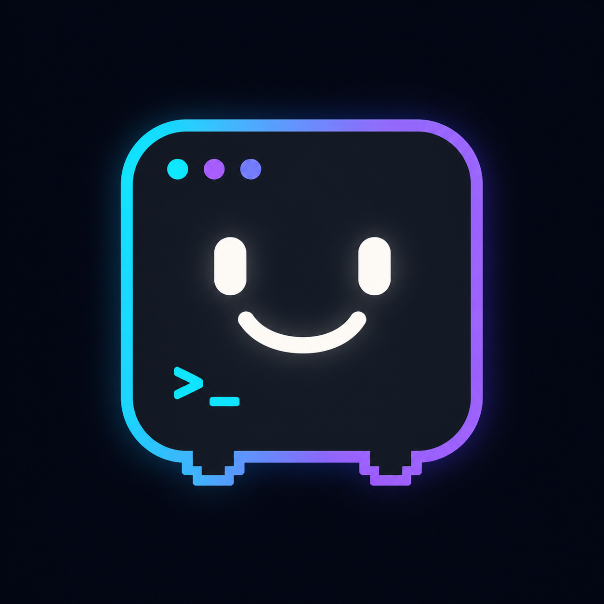
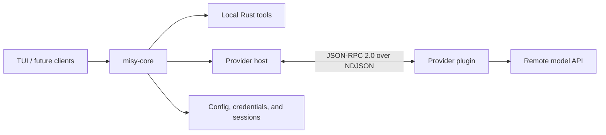

English | [Русский](README-RU.md)

# Misy

<p align="center">
  
</p>

Misy is a small, fast, multi-provider agent harness built around a headless Rust core. It owns the
agent loop, local tools, credentials, sessions, cancellation, and events; user interfaces remain
thin clients, and provider integrations run as independent subprocess plugins.

The terminal UI is the first client. The long-term goal is a reusable foundation for local coding
agents rather than a monolithic terminal application tied to one model provider or frontend.

> [!WARNING]
> Misy is under active development and is not ready for general use. Interfaces, data formats, and
> workflows may change, and there is no migration path for stored data yet. Contributors and early
> experimenters are welcome, but do not rely on Misy for production work or important data.

## Community

Join the [official Misy Telegram community](https://t.me/+xgL2SznTpPxiMTRi) to discuss the project,
ask questions, share ideas, and coordinate contributions.

## Why Misy

Most agent tools combine interface code, orchestration, provider-specific behavior, and local tool
execution in one application. That makes it difficult to add another frontend, replace a provider,
or reason about which component can access credentials and the local machine.

Misy separates those responsibilities:



- **The Rust core is the harness.** It owns persisted conversation state, the FIFO submission
  queue, the agent/tool loop, provider supervision, authentication, cancellation, and normalized
  events.
- **Frontends are clients.** The TUI renders core state and sends user actions; it does not
  reimplement orchestration. Other clients can be built on the same core contract later.
- **Providers are adapters.** Each provider is a standalone, language-independent process that
  translates between a remote API and Misy's versioned protocol. It never executes local tools or
  owns Misy's credential files.
- **Local capabilities stay local.** Tool definitions, argument validation, and execution belong
  to the Rust core, which keeps the security boundary visible and testable.

The architecture is documented in [docs/architecture.md](docs/architecture.md). The full
documentation index is at [docs/README.md](docs/README.md).

## Current state

The repository already contains a working development-stage vertical slice:

- a reusable async `misy-core` crate with configuration, opaque credential storage, model caching,
  append-only conversation sessions, FIFO prompt scheduling, streaming events, cancellation, and
  provider process lifecycle management;
- a fullscreen Ratatui client with a multiline composer, prompt history, transcript scrolling and
  copying, command completion, provider authentication, model selection, session resume, queued
  prompts, streaming output, tool rendering, interruption, and clean terminal restoration;
- a versioned JSON-RPC 2.0 provider protocol with manifest discovery, lazy process startup,
  streaming chat, browser and device authentication flows, credential refresh, model discovery,
  request cancellation, and an optional normalized usage capability;
- bundled subscription-based provider plugins for OpenAI, Anthropic, and Kimi, implemented in
  TypeScript and run with Bun;
- Rust-owned filesystem and unified `exec_command` tools, including JSON Schema validation,
  automatic foreground-to-background yielding, optional macOS/Linux PTY input through
  `write_stdin`, ordered bounded output, cancellation, and process-group cleanup;
- independent synchronous and background child-agent sessions with inherited context, scoped
  tools, addressable messaging, bounded transcripts, and a pull-based completion mailbox;
- unit, integration, end-to-end, and provider contract tests that use local fixtures instead of
  real accounts or external network access.

This is an MVP foundation, not a stable release. One process still owns one attached conversation
at a time, and the TUI does not yet support prompt-based authentication such as entering API keys.

## Planned work

The following areas are intentionally deferred and remain open for future development:

- explicit permissions and approval flows for local tools;
- MCP integration;
- recursive agent trees, roles, batch spawning, and isolated agent worktrees;
- provider marketplace installation and updates;
- API-key and generic prompt-based authentication;
- a daemon or public IPC boundary for multiple clients;
- additional clients, including a possible desktop UI.

This list describes direction, not a promised order or release schedule. Architecture and UX
decisions already recorded in [docs/decisions-and-references.md](docs/decisions-and-references.md)
should be respected when proposing work.

## Try it locally

You need:

- Rust `1.94.0` with `rustfmt` and Clippy (the repository's `rust-toolchain.toml` selects it);
- [Bun](https://bun.sh/) for the bundled TypeScript providers;
- a supported provider subscription to make real model requests.

Install the TypeScript dependencies once:

```console
cd plugins/providers/_sdk && bun install --frozen-lockfile
cd ../openai && bun install --frozen-lockfile
cd ../anthropic && bun install --frozen-lockfile
cd ../kimi && bun install --frozen-lockfile
cd ../../..
```

Then start the terminal client from the repository root:

```console
cargo run -p misy-tui
```

Inside Misy, use `/provider` to authenticate, `/model` to select a model, `/status` to inspect
provider limits when supported, and `/exit` to shut down cleanly. Type `?` to see keyboard
shortcuts.

Misy stores configuration, credentials, model metadata, and prompt history under `~/.misy` by
default. Use a separate development profile when experimenting:

```console
cargo run -p misy-tui -- -c /path/to/profile
cargo run -p misy-tui -- --config="/path with spaces/profile"
```

## Contributing

Contributions are welcome while the project is taking shape. Start by reading the
[documentation index](docs/README.md), then follow the document for the area you want to change:

### Help test real-world combinations

The maintainer currently develops and manually tests Misy on macOS, primarily with Codex and Kimi
accounts. One person cannot cover every operating system, provider, subscription tier,
authentication flow, and model family. The more people exercise different combinations, the more
reliable Misy can become.

Testing and fixes are especially welcome from developers using Linux or Windows, Anthropic or
other provider setups, different subscription tiers, and models outside the maintainer's regular
workflow. When reporting a problem, include the operating system, provider, subscription or
authentication type, selected model, and reproduction steps—but never include credentials or
tokens.

| Area | Start here | Main location |
| --- | --- | --- |
| Core and tools | [Architecture](docs/architecture.md) | `crates/misy-core/` |
| Terminal UI | [TUI Client](docs/tui-client.md) | `crates/misy-tui/` |
| Providers | [Provider Plugins](docs/provider-plugins.md) | `plugins/providers/` |
| Conventions | [Code Style](docs/code-style.md) | `docs/code-style-*.md` |
| Verification | [Development and Testing](docs/development-and-testing.md) | package tests |

Development happens on `dev`; do not work directly on `main`. Keep changes within the approved
architecture, add tests for behavior changes, and update the relevant documentation when a public
contract or user-visible behavior changes.

Before submitting a change, run only checks that validate the inputs or behavior you changed. A
documentation-only edit does not require Rust or provider suites unless it changes compiled
examples, generated output, or executable contracts. The complete, authoritative selection rules
and command list are maintained in
[docs/development-and-testing.md](docs/development-and-testing.md). Rust changes should pass the
applicable formatting, Clippy, and focused or workspace tests:

```console
cargo fmt --all -- --check
cargo clippy --workspace --all-targets -- -D warnings
cargo test
```

Each TypeScript provider and `plugins/providers/_sdk` exposes the same package checks:

```console
bun test
bun run typecheck
bun run check
```

## Writing a provider

A provider package contains a `misy-plugin.json` manifest, an executable or source entry point,
its language-native metadata, tests, documentation, and license. Bundled packages live under
`plugins/providers/<provider-id>/`; locally installed packages are discovered under
`~/.misy/plugins/providers/<provider-id>/`.

Providers may be written in any language. They communicate through JSON-RPC 2.0 with one JSON
object per line on stdin and stdout. Protocol version 2 covers authentication, model discovery,
streaming chat, and cancellation; optional capabilities are negotiated independently through the
manifest. The host discovers manifests without starting every provider and launches a selected
provider lazily.

See [docs/provider-plugins.md](docs/provider-plugins.md) for the protocol and lifecycle contract,
and the bundled [OpenAI](plugins/providers/openai/README.md),
[Anthropic](plugins/providers/anthropic/README.md), and [Kimi](plugins/providers/kimi/README.md)
packages for working examples.
