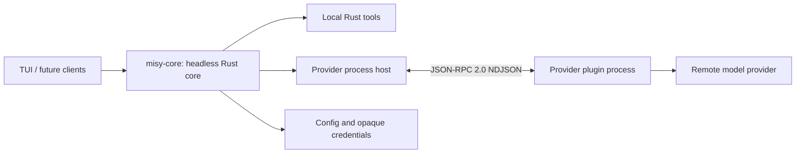

# Architecture

## Table of Contents

- [Purpose](#purpose)
- [System Boundaries](#system-boundaries)
- [Runtime Flow](#runtime-flow)
- [Fixed Constraints](#fixed-constraints)
- [Change Impact](#change-impact)
- [Sources of Truth](#sources-of-truth)

## Purpose

Read this document before changing ownership, lifecycle, sessions, tools, provider supervision, or frontend boundaries.

## System Boundaries

- The `misy-core` workspace crate owns normalized state, configuration, credentials, the persisted model catalog
  cache (`~/.misy/models.json`), the in-memory conversation, FIFO submission scheduling,
  agent/tool iteration, cancellation, provider supervision, and public events. Clients read the
  model cache through the core. The core also owns capability negotiation, credential injection,
  deadlines, and validation for
  provider-normalized account-limit reports.
- `config.toml`, the credential files, and `models.json` each carry a format version, but no
  migration path is implemented yet: a version mismatch is rejected (`UnsupportedVersion`) or
  treated as empty. This is an accepted MVP trade-off — the first version bump of any of these
  formats MUST ship with a migration (or an explicit reset-with-notice policy), because silently
  rejecting the previous format would log every user out and drop the model catalog on a routine
  upgrade.
- `misy-core` is an async Tokio library. It owns a private multi-thread Tokio runtime so provider
  supervision and queued work survive callers using another runtime or dropping an operation
  future. Its public async operations are safe to call from a client's runtime.
- The `misy-tui` workspace crate and future desktop or third-party programs are clients of the
  core. They do not duplicate orchestration state.
- `CoreSnapshot` is the cheap, in-memory client projection of the selected model, active and
  queued submissions, and cached provider authentication state. Reading it never performs
  filesystem, process, or network I/O; clients refresh their projections after relevant core
  events rather than maintaining a competing source of truth.
- Rust owns local tool definitions and execution. Provider plugins only translate between Misy's
  normalized contract and a remote provider protocol.
- Frontends acquire clipboard media, but the core owns image validation, normalized bytes,
  session attachment state, and `view_image` execution. Provider plugins receive only normalized
  image data and never read local image paths.
- One Misy process currently represents one agent session and one in-memory conversation. A daemon or shared multi-client service is not part of the MVP.

## Runtime Flow

1. The core discovers provider manifests without starting plugin processes and starts its private
   Tokio runtime.
2. A client selects a provider/model and invokes public core operations.
3. The host lazily starts only the provider being used.
4. Every inference carries an explicit provider and model.
5. Provider stream events become normalized `CoreEvent` values.
6. Tool calls execute locally in Rust; results return to the same provider/model loop.
7. Submission cancellation, interactive-authentication cancellation, and shutdown propagate
   through the core to provider processes. Because protocol v2 has no auth-cancellation method,
   cancelling interactive authentication terminates that provider process and the next operation
   starts a clean replacement.
8. Direct-interaction submissions enter one core-owned FIFO queue. Exactly one submission mutates
   session history at a time; cancelling the active submission advances the next queued item,
   while cancelling all submissions prevents every pending item from starting.
9. Optional provider capabilities are negotiated from the discovered manifest before a request.
   For usage capability version 1, the core snapshots the selected `ModelRef`, refreshes and
   injects its opaque credentials, bounds `usage.get` to 30 seconds, and strictly validates the
   normalized result. The provider retains ownership of remote endpoint selection, headers, and
   provider-specific response parsing.
10. Image input requires both provider capability version 1 and model image modality support.
    The core rejects unsupported submissions before acceptance, includes normalized images in the
    provider request, and clears binary attachment data from completed in-memory history entries.

## Fixed Constraints

- The architecture is approved and changes only by explicit user decision.
- Provider plugins are language-independent standalone packages and subprocesses.
- The selected model is a default for direct interaction, not a global singleton assumption; future agents may use other provider/model pairs.
- External clients must reuse the `misy-core` contract, including its public async operations,
  events, cancellation methods, and `CoreSnapshot` projection.
- The multimodal public-domain additions ship with the workspace contract version `0.2.0`;
  provider protocol v2 remains compatible because image fields are capability-gated.

## Change Impact

Changing ownership or event semantics affects the core, TUI, provider host, integration tests, and future clients. Update this document and the relevant linked domain document together.

## Sources of Truth

- [`crates/misy-core/src/lib.rs`](../crates/misy-core/src/lib.rs)
- [`crates/misy-core/src/core.rs`](../crates/misy-core/src/core.rs)
- [`crates/misy-core/src/core/agent.rs`](../crates/misy-core/src/core/agent.rs)
- [`crates/misy-core/src/core/events.rs`](../crates/misy-core/src/core/events.rs)
- [`crates/misy-core/src/core/snapshot.rs`](../crates/misy-core/src/core/snapshot.rs)
- [Provider Plugins](provider-plugins.md)
- [TUI Client](tui-client.md)
