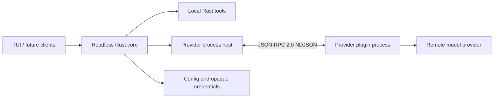

# Architecture

## Table of Contents

- [Purpose](#purpose)
- [System Boundaries](#system-boundaries)
- [Runtime Flow](#runtime-flow)
- [Fixed Constraints](#fixed-constraints)
- [Change Impact](#change-impact)
- [Sources of Truth](#sources-of-truth)

## Purpose

Read this document before changing ownership, lifecycle, sessions, tools, provider supervision, or frontend boundaries.

## System Boundaries

- The Rust core owns normalized state, configuration, credentials, the in-memory conversation, agent/tool iteration, cancellation, provider supervision, and public events.
- The TUI and future desktop or third-party programs are clients of the core. They do not duplicate orchestration state.
- Rust owns local tool definitions and execution. Provider plugins only translate between Misy's normalized contract and a remote provider protocol.
- One Misy process currently represents one agent session and one in-memory conversation. A daemon or shared multi-client service is not part of the MVP.

## Runtime Flow

1. The core discovers provider manifests without starting plugin processes.
2. A client selects a provider/model and invokes public core operations.
3. The host lazily starts only the provider being used.
4. Every inference carries an explicit provider and model.
5. Provider stream events become normalized `CoreEvent` values.
6. Tool calls execute locally in Rust; results return to the same provider/model loop.
7. Cancel and shutdown propagate through the core to provider processes.

## Fixed Constraints

- The architecture is approved and changes only by explicit user decision.
- Provider plugins are language-independent standalone packages and subprocesses.
- The selected model is a default for direct interaction, not a global singleton assumption; future agents may use other provider/model pairs.
- External clients must reuse the core contract.

## Change Impact

Changing ownership or event semantics affects the core, TUI, provider host, integration tests, and future clients. Update this document and the relevant linked domain document together.

## Sources of Truth

- [`src/lib.rs`](../src/lib.rs)
- [`src/core.rs`](../src/core.rs)
- [`src/core/agent.rs`](../src/core/agent.rs)
- [`src/core/events.rs`](../src/core/events.rs)
- [Provider Plugins](provider-plugins.md)
- [TUI Client](tui-client.md)
