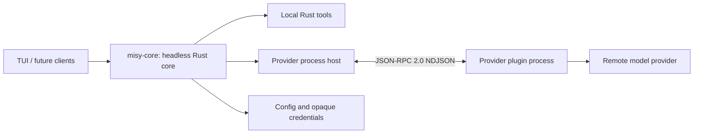

# Architecture

## Table of Contents

- [Purpose](#purpose)
- [System Boundaries](#system-boundaries)
- [Runtime Flow](#runtime-flow)
- [Fixed Constraints](#fixed-constraints)
- [Change Impact](#change-impact)
- [Sources of Truth](#sources-of-truth)

## Purpose

Read this document before changing ownership, lifecycle, sessions, tools, provider supervision, or frontend boundaries.

## System Boundaries

- The `misy-core` workspace crate owns normalized state, configuration, opaque OAuth or API-key
  credentials, the persisted
  model catalog cache (`~/.misy/models.json`), persisted conversations, FIFO submission scheduling,
  agent/tool iteration, cancellation, provider supervision, and public events. Clients read the
  model cache through the core. The core also owns capability negotiation, credential injection,
  deadlines, and validation for
  provider-normalized account-limit reports.
- `config.toml`, the credential files, `models.json`, and session JSONL headers each carry an
  independent format version.
  Config version 1 is atomically migrated to version 2, which adds frontend-owned named
  keybindings; newer unknown revisions are rejected. Credential storage remains version 1 and the
  model cache has its own migration. Every future version bump MUST ship with a migration or an
  explicit reset-with-notice policy.
- `misy-core` is an async Tokio library. It owns a private multi-thread Tokio runtime so provider
  supervision and queued work survive callers using another runtime or dropping an operation
  future. Its public async operations are safe to call from a client's runtime.
- The `misy-tui` workspace crate and future desktop or third-party programs are clients of the
  core. They do not duplicate orchestration state.
- `CoreSnapshot` is the cheap, in-memory client projection of activities, the selected model,
  active and queued submissions, and cached provider authentication state. Reading it never performs
  filesystem, process, or network I/O; clients refresh their projections after relevant core
  events rather than maintaining a competing source of truth.
- Rust owns local tool definitions and execution. Provider plugins only translate between Misy's
  normalized contract and a remote provider protocol.
- Frontends acquire clipboard media, but the core owns image validation, normalized bytes,
  session attachment state, and `view_image` execution. Provider plugins receive only normalized
  image data and never read local image paths.
- One Misy process owns one attached conversation at a time. Conversations are incrementally
  persisted as private append-only files in `~/.misy/sessions/*.jsonl`; starting a new session
  detaches the current file, and resuming restores canonical core history before appending to the
  same file. A daemon or shared multi-client service is not part of the MVP.

## Runtime Flow

1. The core discovers provider manifests without starting plugin processes and starts its private
   Tokio runtime.
2. A client selects a provider/model and invokes public core operations.
3. The host lazily starts only the provider being used.
4. Every inference carries an explicit provider and model.
5. Provider stream events become normalized `CoreEvent` values.
6. Tool calls execute locally in Rust; results return to the same provider/model loop.
7. Submission cancellation, interactive-authentication cancellation, and shutdown propagate
   through the core to provider processes. Because protocol v2 has no auth-cancellation method,
   cancelling interactive authentication terminates that provider process and the next operation
   starts a clean replacement.
8. Direct-interaction submissions enter one core-owned FIFO queue. Exactly one submission mutates
   session history at a time; cancelling the active submission advances the next queued item,
   while cancelling all submissions prevents every pending item from starting.
9. Every canonical history entry is appended to the attached versioned session JSONL after it
   enters memory. The first entry lazily creates the file with mode `0600`, a canonical cwd, model,
   and schema header. Persistence failure emits `SessionPersistenceFailed` without discarding the
   in-memory turn. Session switching is rejected while active or queued work exists.
10. Optional provider capabilities are negotiated from the discovered manifest before a request.
   For usage capability version 1, the core snapshots the selected `ModelRef`, refreshes and
   injects its opaque credentials, bounds `usage.get` to 30 seconds, and strictly validates the
   normalized result. The provider retains ownership of remote endpoint selection, headers, and
   provider-specific response parsing.
11. Image input requires both provider capability version 1 and model image modality support.
    The core refreshes stale selected-provider metadata before rejecting a submission, includes
    normalized images in bounded in-memory history for visual follow-ups, and replaces older image
    payloads when the user attaches a new image set. Text-only models receive image-free history.
12. The unified `exec_command` tool spawns shell commands under a core-owned activity manager.
    Every live process reserves one of 64 permits before spawn; foreground calls may publish the
    same process after a bounded yield without acquiring another permit. Pipe commands use process
    groups with closed stdin. On macOS and Linux, optional PTY commands use a writable terminal and
    a dedicated process group; stop and shutdown close input and escalate bounded `TERM` to `KILL`
    before reaping. Windows PTY support remains deferred and `tty = true` fails explicitly there.
    Ordered stdout/stderr capture has one 1 MiB data-plus-metadata budget per activity, model
    delivery has a separate `max_output_tokens` projection, and the latest twenty terminal tasks
    remain available to clients.
13. Terminal activity events and full bounded snapshots are client contracts. They let the TUI
    refresh its activity popup, fullscreen log viewer, and transcript after cleanup and output
    draining. The model is not notified when a background command finishes: it must pull new output
    and the final `exit_code` with empty `write_stdin` calls. A final model delivery is consumed
    once, while the terminal summary and client snapshot remain in the recent-task registry.
14. A main conversation may spawn up to four process-local child-agent sessions. Each child owns
    an ephemeral history, cancellation/request slots, inbox, model selection, and command owner;
    only the main history is persisted. Children inherit a completed parent-history prefix and
    cannot recursively spawn agents. Concurrent chats on one provider are routed by request ID.
15. Background agent results reserve one of eight lossless mailbox slots and are pulled by the
    model with `agent_wait`; `AgentFinished` independently informs clients. Child commands share
    the 64-process limit, are capped at 48 collectively and 16 per child, and are reaped before
    terminal agent publication. Main plus four active child histories retain at most 100 MiB of
    image payloads; retained semantic transcripts omit image bytes and use a 1 MiB budget.
16. Agent records belong to the current root-conversation generation. Session switching refuses
    live, mailbox, or retained agent state until a client explicitly confirms discard. Shutdown
    closes agent admission, stops and reaps children, then shuts down commands and providers.

## Fixed Constraints

- The architecture is approved and changes only by explicit user decision.
- Provider plugins are language-independent standalone packages and subprocesses.
- The selected model is the main-session default; a child may select another cached,
  authenticated provider/model pair.
- External clients must reuse the `misy-core` contract, including its public async operations,
  events, cancellation methods, and `CoreSnapshot` projection.
- Child agents ship with workspace contract version `0.3.0`; provider protocol v2 remains
  compatible because concurrent chat notifications already carry request IDs.

## Change Impact

Changing ownership or event semantics affects the core, TUI, provider host, integration tests, and future clients. Update this document and the relevant linked domain document together.

## Sources of Truth

- [`crates/misy-core/src/lib.rs`](../crates/misy-core/src/lib.rs)
- [`crates/misy-core/src/core.rs`](../crates/misy-core/src/core.rs)
- [`crates/misy-core/src/core/agent.rs`](../crates/misy-core/src/core/agent.rs)
- [`crates/misy-core/src/core/events.rs`](../crates/misy-core/src/core/events.rs)
- [`crates/misy-core/src/core/snapshot.rs`](../crates/misy-core/src/core/snapshot.rs)
- [Provider Plugins](provider-plugins.md)
- [TUI Client](tui-client.md)
